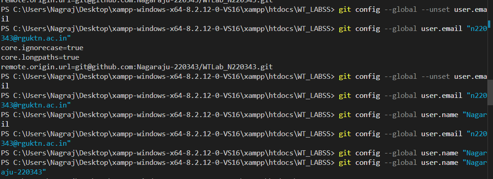
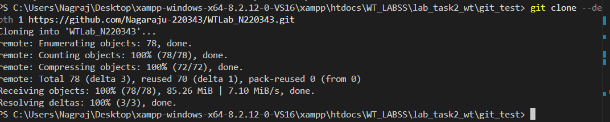
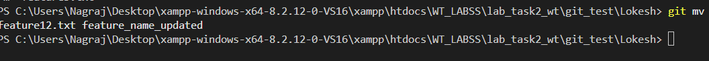

#1. Git Configuration Commands

       # 1. git config --global user.name
            Syntax:
                 git config --global user.name "Your Name"
            Purpose:
                Sets the username for Git commits.
                Whenever you commit code, Git records who made the change.

            Example:      git config --global user.name "Nagaraju"
          

    #  2. git config --global user.email
            Syntax:
                git config --global user.email "your_email@example.com"
            Purpose:
                Sets the email address associated with your commits.
                This email should normally be the same as your GitHub email.

            Example
                git config --global user.email "nagaraju@gmail.com"
            Explanation:
                When you push to GitHub, GitHub links commits to your account using this email.

      #  3. git config --list
            Syntax:
                git config --list
            Purpose:
                Shows all Git configuration settings currently applied.

            Example Output:
                user.name=Nagaraju
                user.email=nagaraju@gmail.com
                core.editor=code
            Explanation:

                This command helps you verify: username,email,editor,default branch, other configurations

        4. git config --unset
            Syntax:
               git config --global --unset user.name
            Purpose:
               Removes a configuration setting.

            Example:
               Remove email configuration:  git config --global --unset user.email
            Explanation:

                Used when you want to reset or change configuration.
  

#2. Repository Setup Commands
        These commands help you create or download repositories.

       # 5. git init
            Syntax: git init
            Purpose:  Initializes a new Git repository in a folder.

            Example
                mkdir project
                cd project
                git init
            Explanation:  creates a hidden folder .git
                         This folder stores:commit history,branches,configuration, version tracking data

       # 6. git clone
            Syntax: git clone <repository-url>
            Purpose: Downloads a copy of a remote repository from GitHub.

            Example: git clone https://github.com/user/project.git
        
       # 7. git clone --branch
             
            Syntax: git clone --branch <branch-name> <repo-url>
            Purpose: Clones only a specific branch.

            Example:
              git clone --branch develop https://github.com/user/project.git
            Explanation:
              Instead of downloading the default branch (main), Git clones the develop branch.

        # 8. git clone --depth
            
            Syntax:
               git clone --depth <number> <repo-url>
            Purpose:
               Creates a shallow clone with limited history.
 
            Example:
                git clone --depth 1 https://github.com/user/project.git
            Explanation: Only latest commit is downloaded, not the full history.

            Used when:  repository is very large, you only need latest code

#3. Repository Status & Inspection
         These commands help you inspect repository state.

    9. git status
        Syntax :git status
        Purpose: Shows the current state of the working directory.

        Example Output:
                    On branch main
                    Changes not staged for commit:
                    modified: index.html

        Explanation: Shows:modified files,staged files,untracked files, current branch

  

    #  10. git log
            Syntax: git log
            Purpose: Displays complete commit history.

            Example Output:
                        commit 2c1a2d3
                        Author: Nagaraju
                        Date: Mon Feb 10

                        Added login feature
      

     #11. git log --oneline
                Syntax: git log --oneline
                Purpose:Shows short version of commit history.

                Example:
                        f21a3b Added login
                        c34f21 Fixed bug
                Explanation: Useful when the repository has many commits.

    # 12. git log --graph
            Syntax: git log --graph --oneline --all
            Purpose:Shows branch history visually.

            Example
                    * commit A
                    |\
                    | * commit B
                    |/
                    * commit C
            Explanation:Displays branch merges and relationships.

    # 13. git show
            Syntax: git show <commit-id>
            Purpose: Shows details of a specific commit.

            Example  :git show a12b34

     14. git diff
        Syntax: git diff
        Purpose: Shows changes between files.

        Example
            git diff
        Explanation

                Displays:

                - old line
                + new line

                Before staging.

     15. git diff --staged
        Syntax
        git diff --staged
        Purpose: Shows changes that are staged but not committed.

        Example
                git add index.html
                git diff --staged
    16. git blame
            Syntax:git blame <file>
            Purpose:Shows who changed each line of a file.

            Example
                   git blame index.html
            Output
                    a1b2c3 Nagaraju line 1
                    f2e3d4 Vineeth line 2

        

        17. git reflog
            Syntax: git reflog
            Purpose: Shows all recent Git actions.

            Example
                HEAD@{0}: commit
                HEAD@{1}: reset
                HEAD@{2}: checkout
            Explanation: Even deleted commits can be recovered using reflog.

       # 18. git shortlog
            Syntax:git shortlog
            Purpose:Shows commit summary by author.

            Example
                Nagaraju (5):
                fixed bug
                added login

                Vineeth (3):
                updated UI

# 4. File Tracking Commands

    ## git add
        Adds file to staging.
    syntax:    git add file.txt

    ## git add .
        Adds all changes.
     syntax:   git add .
           
    ## git add -p
        Adds changes interactively.
     syntax:   git add -p

    ## git restore
        Restores file changes.
     syntax:   git restore file.txt

    ## git restore --staged
        Unstages file.
    syntax :git restore --staged file.txt

    ## git rm
        Deletes file from repository.
    syntax : git rm file.txt
    
    ## git mv
        Moves or renames file.
     syntax: git mv old.txt new.txt
     
     